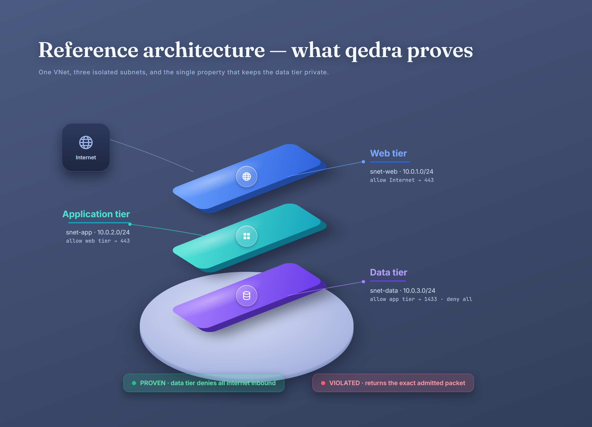
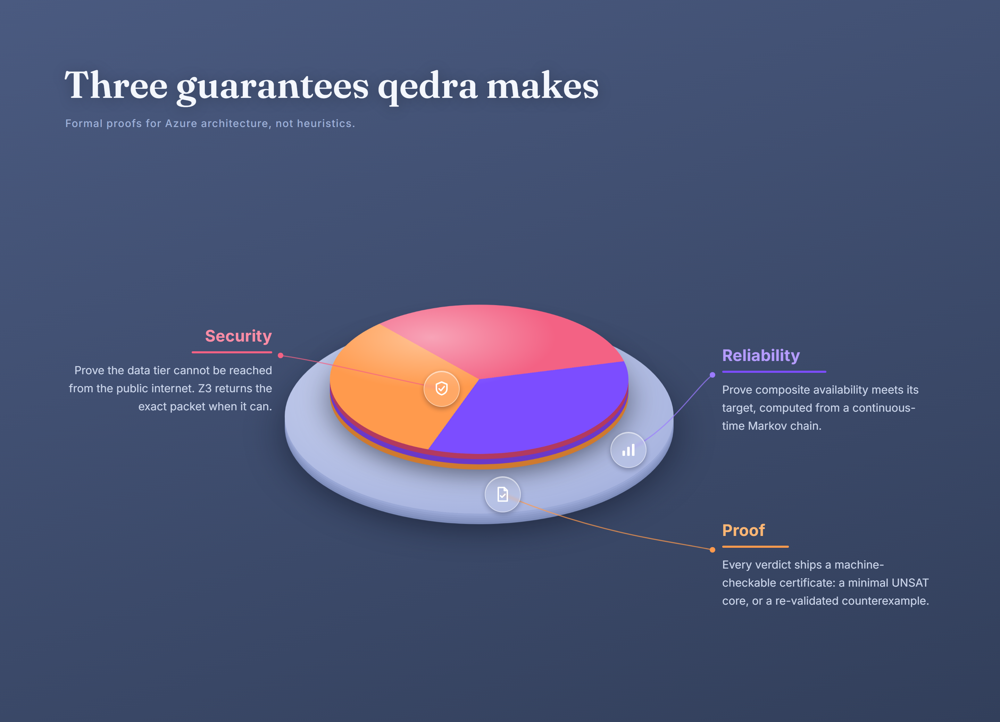
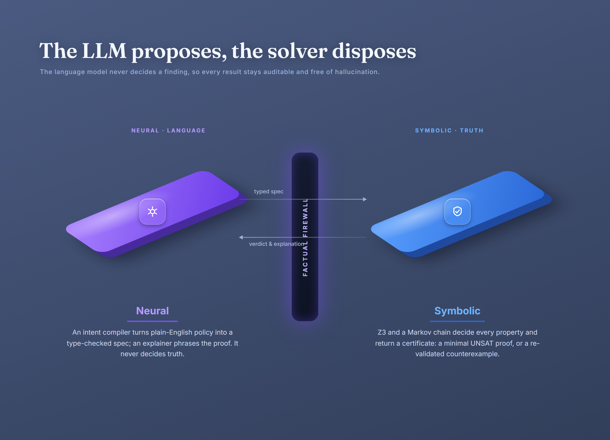
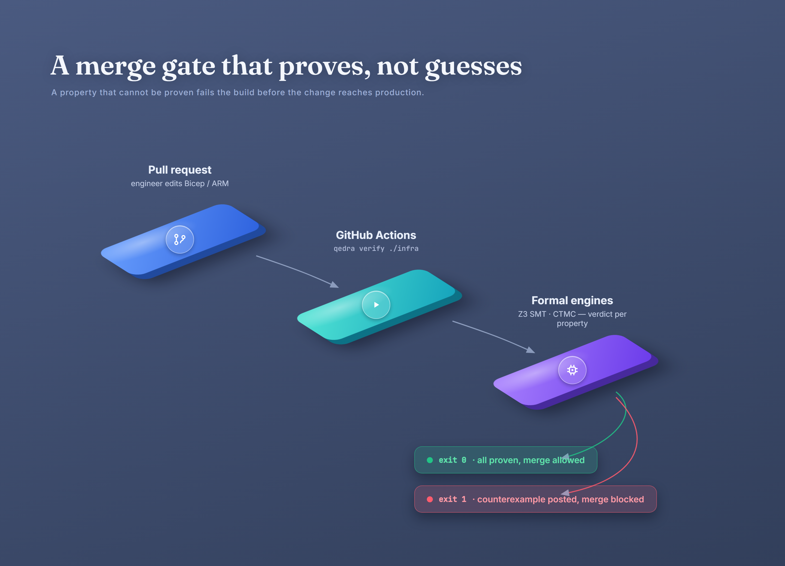

<div align="center">

# qedra

### Prove Azure Well-Architected properties with an SMT solver, instead of guessing them with an LLM

[](https://www.python.org/)
[](LICENSE)
[](https://github.com/Z3Prover/z3)
[](https://github.com/astral-sh/ruff)
[](https://mypy-lang.org/)
[](tests)
[](#why-you-can-trust-an-unsat-result)
[](.github/workflows/ci.yml)

qedra reads your infrastructure, compiles it into a formal model, and <strong>proves</strong> each
property in your Well-Architected contract. Every finding carries a machine-checkable certificate,
so a result is a proof, not an opinion.

</div>

<p align="center">
  
</p>

```text
$ qedra verify ./infra --policy waf-prod.qedra.yaml
#  exit 0   every property proven
#  exit 1   a counterexample was found
```

---

## Contents

- [Why this exists](#why-this-exists)
- [What qedra proves today](#what-qedra-proves-today)
- [Quickstart](#quickstart)
- [What a run looks like](#what-a-run-looks-like)
- [How it works](#how-it-works)
- [Why you can trust an UNSAT result](#why-you-can-trust-an-unsat-result)
- [The policy format](#the-policy-format)
- [Using qedra in CI](#using-qedra-in-ci)
- [Scope and roadmap](#scope-and-roadmap)
- [Learn Azure while you read the code](#learn-azure-while-you-read-the-code)
- [Development](#development)

---

## Why this exists

AWS has shipped *provable security* for a decade.
[Zelkova](https://www.amazon.science/blog/a-decade-of-mathematical-certainty-reflections-on-the-automated-reasoning-group)
reasons about IAM policies with an SMT solver, and
[Tiros](https://d1.awsstatic.com/whitepapers/Security/Reachability_Analysis_for_AWS-based_Networks.pdf)
verifies network reachability. Both now power IAM Access Analyzer and Reachability Analyzer, with
mathematical guarantees rather than heuristics.

Azure has no open-source equivalent. qedra fills that gap, aligned to the Well-Architected
Framework, and built on [Z3](https://github.com/Z3Prover/z3), the SMT solver from Microsoft
Research. Using Microsoft's own solver to prove properties of Microsoft's own cloud is the point.

## What qedra proves today

| Pillar | Property | Engine | Verdict on failure |
| --- | --- | --- | --- |
| Security | The public internet cannot reach a protected subnet through its NSG | Z3 SMT (bit-vector) | A concrete, re-validated packet |
| Reliability | The design meets its availability target | Continuous-time Markov chain | The shortfall and the limiting tier |

Each property resolves to `PROVEN`, `VIOLATED` with a counterexample, or `UNSUPPORTED` when the
model lacks the data to decide. An `UNSUPPORTED` result is reported, never hidden.

## Quickstart

Requires Python 3.11 or newer. Nothing below needs an Azure subscription or an API key.

```bash
git clone https://github.com/araoofuddin/qedra
cd qedra
python -m venv .venv
. .venv/Scripts/activate        # macOS / Linux: . .venv/bin/activate
pip install -e ".[dev]"

qedra verify examples/contoso-secure     # a design that satisfies the baseline
qedra verify examples/contoso-flawed     # the same design with two planted defects
```

## What a run looks like

```text
                             qedra: contoso-flawed
┌─────────┬─────────────┬───────────────────────────────┬──────────┬──────────┐
│ ID      │ Pillar      │ Property                       │ Verdict  │ Severity │
├─────────┼─────────────┼───────────────────────────────┼──────────┼──────────┤
│ SEC-001 │ Security    │ Public internet can reach the │ VIOLATED │ critical │
│         │             │ data tier subnet 'snet-data'  │          │          │
│ REL-001 │ Reliability │ Composite availability falls  │ VIOLATED │ high     │
│         │             │ short of the >= 99.99% target │          │          │
└─────────┴─────────────┴───────────────────────────────┴──────────┴──────────┘

SEC-001  Counterexample: 36.113.0.0 -> 10.0.3.0:1433/Tcp is admitted
REL-001  Composite availability 98.8021% (~517.5 min/month), below 99.9900%
```

Read the full certificate behind any finding:

```bash
qedra explain examples/contoso-flawed SEC-001
```

## How it works

<p align="center">
  
</p>

1. An adapter compiles Bicep, ARM, or live Resource Graph state into a canonical model.
2. An engine encodes each property into a formal theory: bit-vector logic for reachability, a
   Markov chain for availability.
3. The solver returns a verdict. `UNSAT` of a property's negation is a proof; `SAT` is a
   counterexample.
4. qedra re-validates every counterexample against an independent evaluator before reporting it.

A language model, when present, never decides a finding. It compiles plain-English intent into a
type-checked specification and phrases proofs the solver already produced. Truth comes from the
solver, which keeps results auditable and free of hallucination.

<p align="center">
  
</p>

Read the design in [docs/architecture.md](docs/architecture.md), and the engines in
[docs/engines/smt.md](docs/engines/smt.md) and
[docs/engines/reliability.md](docs/engines/reliability.md).

## Why you can trust an UNSAT result

qedra implements Azure NSG semantics twice: once as a plain-Python reference evaluator
([`nsg_eval.py`](src/qedra/domain/nsg_eval.py)), once as a Z3 encoding
([`network.py`](src/qedra/engines/smt/network.py)). A
[property-based test](tests/property/test_smt_vs_reference.py) generates hundreds of random rule
sets and packets and asserts both agree. That agreement is what lets qedra call an `UNSAT` result a
proof. An unsound encoding fails the test suite, not your audit. Every `SAT` witness is run back
through the reference evaluator before qedra reports it.

The bundled [evaluation harness](evals/harness.py) scores the tool against a golden set:

```text
properties checked : 6
accuracy           : 100.0%
precision          : 100.0%
recall             : 100.0%
hallucinated       : 0
```

## The policy format

A policy is the contract your architecture must satisfy. Version it next to your infrastructure.

```yaml
name: waf-prod
security:
  no_internet_inbound:
    tiers: [data]            # subnets tagged tier=data must deny internet inbound
reliability:
  availability: ">= 99.99%"  # proved on the dependency model
```

Generate a starter with `qedra init`.

## Using qedra in CI

<p align="center">
  
</p>

`qedra verify` exits non-zero on the first violation, so it gates a pull request the way a test
suite does. A property that cannot be proven fails the build before the change reaches production.
A ready-to-use workflow ships in [.github/workflows/ci.yml](.github/workflows/ci.yml).

## Scope and roadmap

Implemented in this release:

- Network reachability for internet isolation, with Bicep, ARM, and native ingestion.
- Composite availability against a target, with a per-component breakdown and downtime.
- CLI (`verify`, `explain`, `init`, `version`), JSON and Markdown output, and CI exit codes.

On the roadmap, in order:

| Next | What it adds |
| --- | --- |
| RBAC escalation | Prove no principal can reach Owner on a protected scope, on the same solver |
| Cost | Exact pricing from the Azure Retail Prices API, reserved-instance coverage as an ILP |
| Remediation | MaxSMT synthesis of the smallest change that flips a violation to proven |
| SARIF + intent | GitHub code-scanning output and a neuro-symbolic intent compiler with a report-quality gate |

## Learn Azure while you read the code

The [docs/learn](docs/learn) guides are study companions for the Azure certifications, with each
exam topic linked to the property qedra proves.

| Guide | Covers |
| --- | --- |
| [AZ-104 — Azure Administrator](docs/learn/az-104-azure-administrator.md) | Identity, networking, compute, storage, monitoring |
| [AZ-305 — Infrastructure Solutions](docs/learn/az-305-infrastructure-solutions.md) | Design decisions, topologies, redundancy, and trade-offs |
| [Well-Architected Framework](docs/learn/well-architected-framework.md) | The five pillars, mapped to provable properties |

## Development

```bash
make lint     # ruff
make type     # mypy --strict
make test     # pytest with coverage
make check    # all of the above
```

CI runs the same gate on Python 3.11 and 3.12, including the differential property test that keeps
the SMT encoding honest. See [CONTRIBUTING.md](CONTRIBUTING.md).

## License

Released under the [MIT License](LICENSE).
