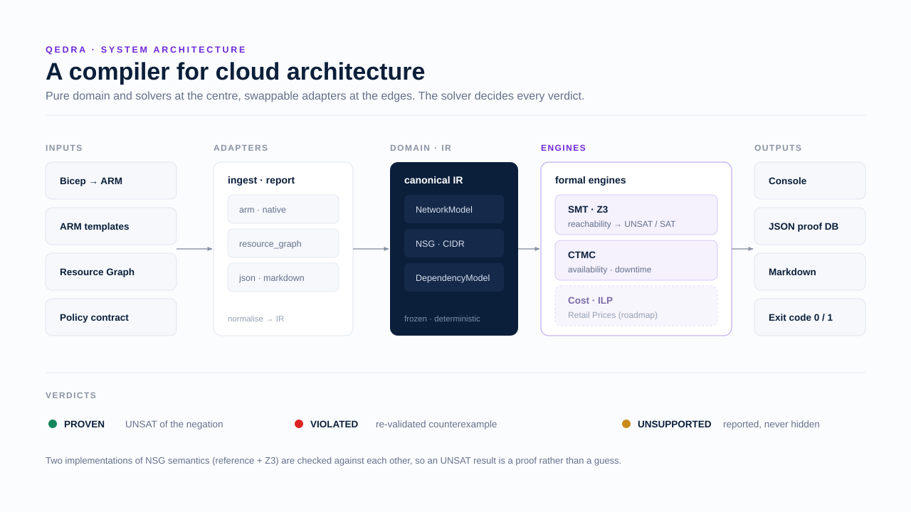
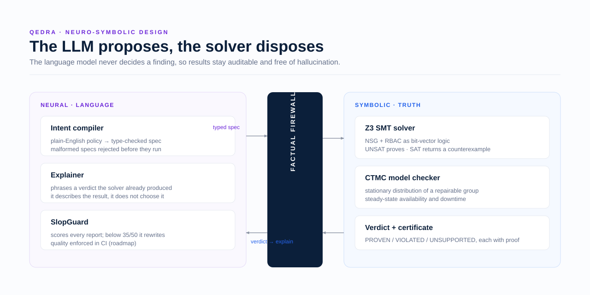
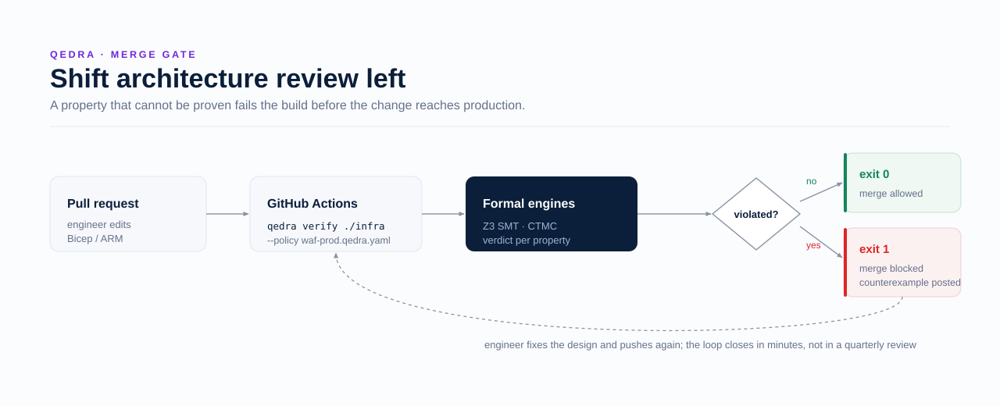

# Architecture

qedra is built as a hexagon: a pure domain and formal engines at the centre, swappable adapters at
the edges. The centre has no dependency on Azure SDKs, the filesystem, or a language model, so it
is deterministic and testable in isolation.

## Layers

**Domain (`src/qedra/domain/`).** The canonical intermediate representation (IR) and the finding
types. `nsg_eval.py` holds the reference NSG semantics that the SMT engine must match. Pure Python,
frozen Pydantic models, no I/O.

**Engines (`src/qedra/engines/`).** The solvers that decide verdicts. `smt/` encodes reachability
into Z3; `reliability/` builds and solves a CTMC. Each engine takes IR in and returns a result; it
never reads a file or calls a network.

**Application (`src/qedra/application/`).** Use cases. `verify.py` routes each policy clause to the
engine that decides it and assembles a report. `policy.py` is the declarative contract.

**Adapters (`src/qedra/adapters/`).** Infrastructure behind ports. `ingest/` turns Bicep, ARM, or
a native model into IR. `report/` renders JSON, Markdown, and console output.

**CLI (`src/qedra/cli/`).** A Typer application that behaves like a compiler: read a model and a
policy, prove each property, print verdicts, and exit non-zero on a violation.

## The verdict model

Every property resolves to one of three verdicts, each bound to a certificate:

- **PROVEN** — the solver returned UNSAT for the property's negation. Holds for every case.
- **VIOLATED** — a concrete, re-validated counterexample exists.
- **UNSUPPORTED** — the model lacks the data to decide. Reported, never hidden.

## The neuro-symbolic boundary

The language model never decides a finding. It compiles intent into a type-checked spec and phrases
proofs the solver already produced. Truth comes from the symbolic side, so results are auditable
and free of hallucination. (The neural layer is on the roadmap; the v1 engines are fully symbolic.)

## In a pipeline

`qedra verify` gates a pull request the way a test suite does: a property that cannot be proven
fails the build before the change reaches production.

## Design decisions

- **Two implementations of NSG semantics** (reference + SMT), checked against each other, so an
  UNSAT result is trustworthy.
- **Self-contained solvers** (Z3 and a NumPy CTMC) so the tool is a plain `pip install`, with no
  external services required to run the proofs.
- **Offline by default**: the bundled examples run with no Azure subscription and no API keys.
